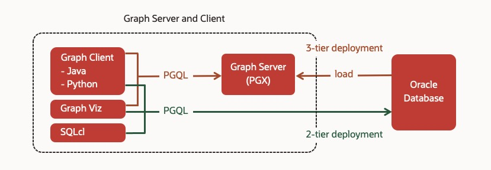

# Oracle Property Graph

The setup instruction and use case exmaples for Oracle's Property Graph.

**The scripts here are my own. Not Oracle's official material.**

## Architecture

## Setup Instruction

There are several quick ways to setup Graph Server:

- [with Autonomous Database](https://github.com/ryotayamanaka/setup_pg_adb)
- [with Database Cloud Service](https://github.com/ryotayamanaka/setup_pg_dbcs)
- [using Docker](https://github.com/ryotayamanaka/setup_pg_docker)

## Use Case Examples

After setting up your demo environment, please try:

- [customer_360](https://github.com/ryotayamanaka/customer_360) - Customer 360 analysis in banking [3-tier deployment]
- [online_retail](https://github.com/ryotayamanaka/online_retail) - Recommendation system in online retail [3-tier deployment]
- [moneyflows](https://github.com/ryotayamanaka/moneyflows) - Find patterns from large money transfer networks [3-tier deployment]
- [mule_account](./graphs/mule_account/README.md) - Fake account detection in fraud analysis [3-tier deployment]
- [tax_fraud](https://github.com/ryotayamanaka/tax_fraud) - Graph visualization for tax fraud detection
- [shortest-path](https://github.com/ryotayamanaka/shortest-path) - Simple example of shortest path queries [PGX standalone]
- [call-tree](https://github.com/ryotayamanaka/call-tree) - Call tree analysis example using reachability queries [PGX standalone]
